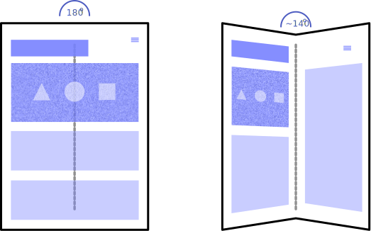
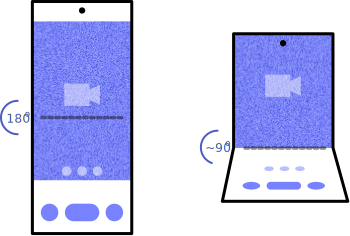
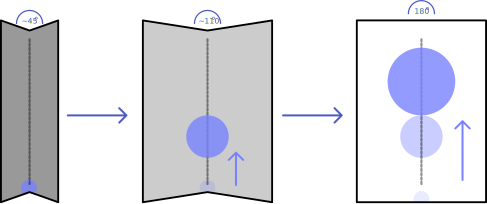

# Fold State Explainer

## Author
* [Diego González-Zúñiga](https://twitter.com/diekus) ([Samsung](https://samsunginter.net))

## Participate
* [Explainer on GitHub](https://github.com/SamsungInternet/Explainers/blob/master/Foldables/FoldState.md)

## Introduction

New types of devices are appearing that have some sort of folding capabilities. Wether they are seamless devices, (like the [Samsung Galaxy Fold](https://www.samsung.com/global/galaxy/galaxy-fold/), Huawei Mate X, Motorola Razr) or devices with seam (like the Microsoft Surface Duo, ZTE Axon M), there are opportunities in adapting the user experience/application depending on the folding state of the device. We propose a way to expose information about folding state and fold angle of the device to the developer. 

## Motivating Use Cases

Foldable devices come in many shapes and sizes. This poses interesting opportunities in the area of responsive design. With these new devices, the user can choose to consume browse the web even when the device is not flat, in which case the developer might want to provide a different layout for the  content.

### Complementary proposals
* [Web Platform Primitives for Enlightened Experiences on Foldable Devices](https://github.com/MicrosoftEdge/MSEdgeExplainers/blob/master/Foldables/explainer.md)

### Scenario 1: "Book mode"

The device displays the web content normally when flat (180°), presenting itself as specified by media queries. When the user folds the device to a specific angle, the layout changes to accommodate a book-like experience where content can avoid the folding area of the device. Once the device goes flat again the content flows according to the available screen size.  

This mode can be interesting for blogs, online magazines or developers that want to mimic the an open book layout.

### Scenario 2: "Table mode"

The user can fold the device in a  the device on a surface (table for example) and use the device while folded in between a specified range  

Examples of uses can include:
* videocall apps
* video streaming apps
* games (battleship-like, cards)

### Scenario 3: "GUI based on Angle value"

The developer can enable the GUI on the web application to react to values from the angle the device is on.

Examples:

* Animate background of a page to change when the user is folding the device. Can have different hues/saturation based on the angle value.  
* Animate objects in a page to react to the opening/closing of the device. Think of a canvas element in a page with an initial composition of mountains at night. When the user starts opening the device the sun can rise accordingly and the composition depicts noon when the device is completely open. 

## Non Goals

This proposal does not deal with foldable screens with more than one hinge.

## Proposal 

### `fold-angle` and `fold-angle-change` event

## Key Scenarios

These APIs are meant to be used in conjuntion with the [Web Platform Primitives for Enlightened Experiences on Foldables](https://github.com/MicrosoftEdge/MSEdgeExplainers/blob/master/Foldables/explainer.md). Combination of both proposals enable tailoring the UX based on the angle which the device is currently positioned. (Some changes include CSS fold environmental variables are needed for this).

* '`spanning`' CSS media feature + CSS fold variable:  

### Scenario 1

### Scenario 2

## Considered Alternatives

## Stakeholder Feedback

## References & Acknowledgements
Many thanks for valuable feedback and advice from:
* [Daniel Appelquist](https://twitter.com/torgo), [Samsung](https://samsunginter.net) 
* [Michael Blix](https://twitter.com/mkeblx), [Samsung](https://samsunginter.net) 

zochahou@microsoft.com
dlibby@microsoft.com